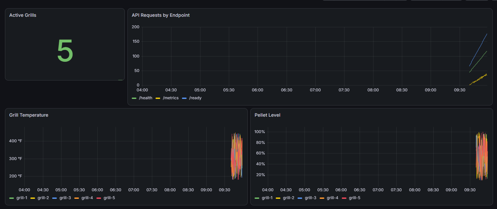

# SmokeStack Ops Observability Guide

## Purpose

This document explains how SmokeStack Ops exposes, collects, and visualizes application metrics using Prometheus and Grafana in a local Kubernetes environment.

The goal of this observability setup is to demonstrate production-style monitoring practices for a containerized API, including:

- Application metrics
- Kubernetes service discovery through internal DNS
- Prometheus scraping
- Grafana visualization
- Request-level troubleshooting support through structured logs and request IDs

---

## Observability Stack

SmokeStack Ops uses the following observability components:

| Component | Purpose |
|---|---|
| FastAPI `/metrics` endpoint | Exposes Prometheus-compatible application metrics |
| Prometheus | Scrapes and stores SmokeStack metrics |
| Grafana | Visualizes metrics through a dashboard |
| Structured JSON logs | Provides request-level troubleshooting data |
| `X-Request-ID` header | Supports log correlation across requests |

---

## Application Metrics

SmokeStack Ops exposes custom Prometheus metrics from the `/metrics` endpoint.

### Request Counter

```text
smokestack_api_requests_total
```

Tracks API requests by endpoint.

Example labels:

```text
endpoint="/health"
endpoint="/ready"
endpoint="/grills"
endpoint="/metrics"
```

This helps identify which endpoints are receiving traffic and how often they are being called.

---

### Active Grills Gauge

```text
smokestack_active_grills
```

Tracks how many simulated smart grills are actively reporting telemetry.

In the current MVP, this value is expected to be:

```text
5
```

---

### Grill Temperature Gauge

```text
smokestack_grill_temperature_fahrenheit
```

Tracks simulated grill temperature by grill ID.

Example labels:

```text
grill_id="grill-1"
grill_id="grill-2"
grill_id="grill-3"
grill_id="grill-4"
grill_id="grill-5"
```

This metric demonstrates how device-specific telemetry can be visualized and monitored.

---

### Pellet Level Gauge

```text
smokestack_pellet_level_percent
```

Tracks simulated pellet level percentage by grill ID.

This metric demonstrates operational monitoring for device state and potential alerting scenarios.

---

## Prometheus

Prometheus is deployed into the `smokestack` Kubernetes namespace.

It scrapes the SmokeStack API through the Kubernetes Service DNS name:

```text
smokestack-api-service.smokestack.svc.cluster.local:80
```

The Prometheus scrape configuration targets:

```text
/metrics
```

at a regular interval.

---

## Deploy Prometheus

From the project root:

```powershell
kubectl apply -f monitoring/prometheus-config.yaml
kubectl apply -f monitoring/prometheus-deployment.yaml
kubectl apply -f monitoring/prometheus-service.yaml
```

Verify Prometheus is running:

```powershell
kubectl get pods -n smokestack -l app=prometheus
kubectl get svc -n smokestack
```

Port-forward Prometheus:

```powershell
kubectl port-forward service/prometheus-service 9090:9090 -n smokestack
```

Open Prometheus:

```text
http://localhost:9090
```

---

## Verify Prometheus Targets

In Prometheus, navigate to:

```text
Status → Targets
```

Expected target:

```text
smokestack-api
```

Expected status:

```text
UP
```

If the target is down, check:

```powershell
kubectl get svc -n smokestack
kubectl get endpoints smokestack-api-service -n smokestack
kubectl logs deployment/prometheus -n smokestack
```

---

## Useful Prometheus Queries

Use these queries in Prometheus or Grafana.

### API Requests by Endpoint

```promql
smokestack_api_requests_total
```

### Active Grills

```promql
smokestack_active_grills
```

### Grill Temperatures

```promql
smokestack_grill_temperature_fahrenheit
```

### Pellet Levels

```promql
smokestack_pellet_level_percent
```

---

## Grafana

Grafana is deployed into the `smokestack` namespace and is provisioned using Kubernetes ConfigMaps.

The Grafana setup includes:

- A Prometheus data source
- A dashboard provider
- A prebuilt SmokeStack dashboard

This means the dashboard is created automatically when Grafana starts.

---

## Deploy Grafana

From the project root:

```powershell
kubectl apply -f monitoring/grafana-datasource.yaml
kubectl apply -f monitoring/grafana-dashboard-provider.yaml
kubectl apply -f monitoring/grafana-dashboard-smokestack.yaml
kubectl apply -f monitoring/grafana-deployment.yaml
kubectl apply -f monitoring/grafana-service.yaml
```

Verify Grafana is running:

```powershell
kubectl get pods -n smokestack -l app=grafana
kubectl get svc grafana-service -n smokestack
kubectl get endpoints grafana-service -n smokestack
```

Port-forward Grafana:

```powershell
kubectl port-forward service/grafana-service 3000:3000 -n smokestack
```

Open Grafana:

```text
http://localhost:3000
```

Default local credentials:

```text
Username: admin
Password: admin
```

---

## SmokeStack Grafana Dashboard

The dashboard is available at:

```text
Dashboards → SmokeStack → SmokeStack Ops
```

The dashboard includes panels for:

- Active grills
- API requests by endpoint
- Grill temperature
- Pellet level

---

## Dashboard Screenshot

Current dashboard validation:



---

## Interpreting the Dashboard

### Active Grills

The Active Grills panel should show:

```text
5
```

This confirms the application is generating telemetry for five simulated grills.

---

### API Requests by Endpoint

The API request graph shows request counts grouped by endpoint.

Expected behavior:

- `/ready` increases regularly because Kubernetes readiness probes call it.
- `/metrics` increases regularly because Prometheus scrapes it.
- `/health` increases when manually tested or called by Kubernetes liveness probes.
- `/grills` increases when the telemetry endpoint is manually requested.

This is useful because it shows the difference between user traffic, Kubernetes health checks, and monitoring traffic.

---

### Grill Temperature

The Grill Temperature panel shows simulated temperatures for each grill.

Because this is generated test data, the values fluctuate between requests.

This panel demonstrates how device telemetry can be monitored over time.

---

### Pellet Level

The Pellet Level panel shows simulated pellet percentage by grill.

This could later support alerting for low pellet levels.

Example future alert:

```text
Trigger an alert when pellet level drops below 15%.
```

---

## Structured Logs

SmokeStack Ops logs each request as structured JSON.

Each request log includes:

```text
request_id
method
path
status_code
duration_ms
client_ip
event
```

Example:

```json
{"request_id":"d95fa691-98e5-4796-a64f-f26482401f94","method":"GET","path":"/health","status_code":200,"duration_ms":2.14,"client_ip":"127.0.0.1","event":"request_completed"}
```

View logs from Kubernetes:

```powershell
kubectl logs -l app=smokestack-api -n smokestack
```

---

## Request ID Correlation

Each API response includes an `X-Request-ID` header.

Example:

```text
x-request-id: d95fa691-98e5-4796-a64f-f26482401f94
```

This allows a request from a client, Kubernetes probe, or monitoring system to be correlated with application logs.

Test it with:

```powershell
curl.exe -i http://localhost:8000/health
```

---

## Generate Dashboard Traffic

To create visible activity in Grafana, send requests to the API:

```powershell
curl.exe http://localhost:8000/health
curl.exe http://localhost:8000/ready
curl.exe http://localhost:8000/grills
curl.exe http://localhost:8000/metrics
```

To generate repeated traffic:

```powershell
1..20 | ForEach-Object { curl.exe http://localhost:8000/grills }
```

---

## Troubleshooting

### Prometheus Target Is Down

Check the SmokeStack API Service:

```powershell
kubectl get svc smokestack-api-service -n smokestack
kubectl get endpoints smokestack-api-service -n smokestack
```

Check Prometheus logs:

```powershell
kubectl logs deployment/prometheus -n smokestack
```

Confirm the API metrics endpoint works:

```powershell
kubectl port-forward service/smokestack-api-service 8000:80 -n smokestack
curl.exe http://localhost:8000/metrics
```

---

### Grafana Cannot Connect to Prometheus

Check the Grafana data source ConfigMap:

```powershell
kubectl describe configmap grafana-datasource -n smokestack
```

Verify Prometheus Service exists:

```powershell
kubectl get svc prometheus-service -n smokestack
```

Check Grafana logs:

```powershell
kubectl logs deployment/grafana -n smokestack
```

---

### Grafana Dashboard Does Not Appear

Check dashboard provisioning ConfigMaps:

```powershell
kubectl get configmap -n smokestack
kubectl describe configmap grafana-dashboard-provider -n smokestack
kubectl describe configmap grafana-dashboard-smokestack -n smokestack
```

Restart Grafana after ConfigMap changes:

```powershell
kubectl rollout restart deployment/grafana -n smokestack
kubectl rollout status deployment/grafana -n smokestack
```

---

### Port Forward Fails

Check whether the pod is running:

```powershell
kubectl get pods -n smokestack -l app=grafana
```

Check whether the Service has endpoints:

```powershell
kubectl get endpoints grafana-service -n smokestack
```

Try a different local port:

```powershell
kubectl port-forward service/grafana-service 3001:3000 -n smokestack
```

Then open:

```text
http://localhost:3001
```

---

## Cleanup

Delete monitoring resources:

```powershell
kubectl delete -f monitoring/
```

Delete the full SmokeStack Kubernetes environment:

```powershell
kubectl delete -f monitoring/
kubectl delete -f k8s/
```

---

## Portfolio Summary

This observability setup demonstrates that SmokeStack Ops can be monitored like a production-style cloud-native service.

It includes:

- Custom application metrics
- Prometheus scraping
- Grafana dashboard provisioning
- Kubernetes-native deployment
- Structured JSON logs
- Request ID correlation
- Troubleshooting commands
- Operational documentation

This maps directly to DevOps responsibilities such as monitoring, troubleshooting, observability, incident response, and production support.
